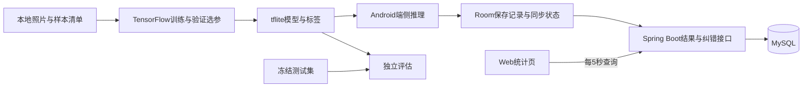

# 模块与数据流

以下为开发计划书的架构安排，当前模块尚未实现。

- 训练侧在本地 PC 读取样本清单，使用固定划分与候选配置，并输出可追溯的模型包。
- Android 在后台处理图片与推理，Room 保存原预测、模型版本、UUID、纠错和同步状态；上传失败不影响本地识别。
- 后端校验上报记录并以 UUID 去重，以递增修订号处理纠错；MySQL 保存类别、模型、记录与样本元数据。
- Web 读取统计和分页记录，区分原预测与人工修正，显示最新刷新状态。
- 最终模型使用冻结测试集独立评估，准确率和真机耗时来自专门测试。

关键交接文件：共享类别映射、样本与划分清单、模型包元数据、接口说明、验收和性能记录。具体归属见根目录 README 与 `planning/task-allocation.md`。
