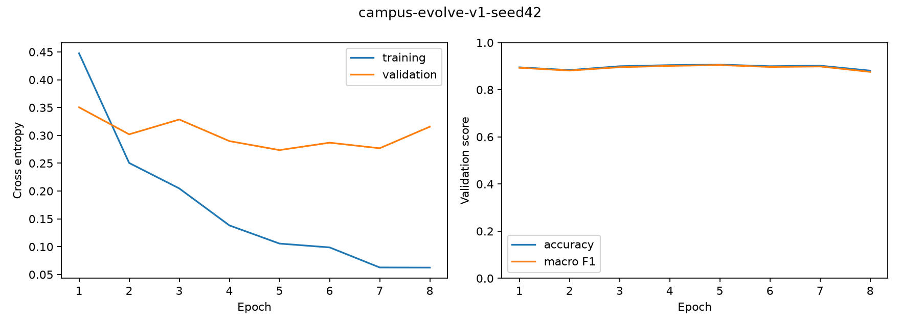
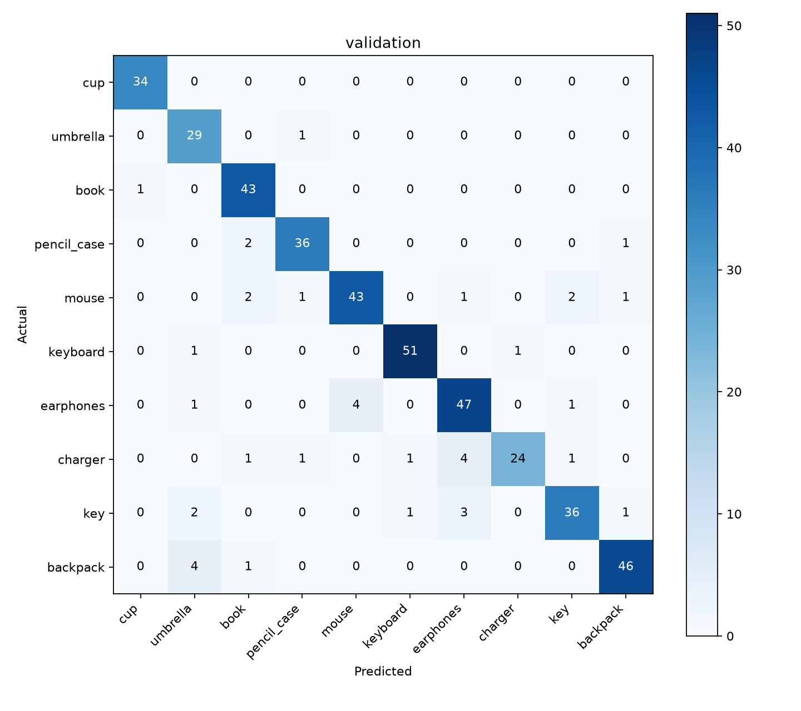

# campus-evolve-v1 首批训练结果

记录日期：2026-10-10。候选模型已完成技术冻结，已登记[审核网页](https://49.232.195.47:8443/candidates/campus-evolve-v1)，发布审批待管理员决定；当前使用的基准仍为 `campus-gpu-v1`。

本轮重新审核公开候选1,409张，通过820张、拒绝589张；原877张公开照片继续保留。新增入库的820张含356张主体裁剪，裁剪不另计原始照片。来源为Commons 602张、Open Images 218张，不记作自采成果。冻结包保留179张自动通过的来源记录，自动审核与人工标签均可能有误，抽检不构成总体准确率保证。

数据版本 `campus-evolve-data-v1`，类别 `campus-10-v4`：训练1,268张、验证429张，其中新增训练609张、新增验证211张。原659/218张归属逐项保持；原图、裁剪、来源、实物及重复组共同参与隔离。键盘包括笔记本内置特写，伞包括遮阳伞；固定十类输出顺序不变。

| 类别 | 训练 | 验证 | 新增训练 | 新增验证 |
| --- | ---: | ---: | ---: | ---: |
| 水杯 | 104 | 34 | 31 | 10 |
| 伞 | 92 | 30 | 69 | 23 |
| 书本 | 131 | 44 | 87 | 29 |
| 笔袋 | 115 | 39 | 38 | 13 |
| 鼠标 | 147 | 50 | 54 | 19 |
| 键盘 | 141 | 53 | 93 | 37 |
| 耳机 | 156 | 53 | 50 | 18 |
| 充电器 | 96 | 32 | 65 | 22 |
| 钥匙 | 131 | 43 | 53 | 17 |
| 背包 | 155 | 51 | 69 | 23 |

从基准同一个最佳Keras检查点开始微调MobileNetV2最后1块及最终Conv_1，所有BN冻结，骨干training=False；新Adam、学习率0.0001、Dropout 0.4、batch32、种子42/43、最多20轮，验证损失早停3轮。只增强训练图，完整float32计算并关闭TF32。RTX 4060 Laptop、WSL Ubuntu 24.04、Python3.12.3、TensorFlow2.21.0；源码提交 `20f148689bd46b94d6f9eaac532faac94424e080`。

| 运行 | 实际轮数 | 最佳轮 | 公开验证准确率 | 宏F1 | 训练计算秒数 |
| --- | ---: | ---: | ---: | ---: | ---: |
| 主实验 seed42 | 8 | 5 | 90.68% | 0.9048 | 44.61 |
| 复核 seed43 | 7 | 2 | 90.21% | 0.8988 | 35.60 |

两次宏F1差为0.0059，未触发>0.05时增加种子44的条件。计算时间不包含读图、保存、导出和核验。候选包固定使用seed42最佳检查点。

以下使用相同验证照片分别比较新旧模型，属于开发评估；新增验证图包含新类别口径，不能与旧版原验证成绩直接混为同一难度。

| 验证子集 | 样本数 | 基准准确率 | 候选准确率 | 基准宏F1 | 候选宏F1 |
| --- | ---: | ---: | ---: | ---: | ---: |
| 原公开验证集 | 218 | 90.37% | 92.66% | 0.8993 | 0.9174 |
| 新增公开开发验证集 | 211 | 83.89% | 88.63% | 0.8322 | 0.8803 |

整体提升并不代表每一类都改善。以下列出同图比较中的类别F1下降项；新增钥匙仅17张验证图，应在后续新实拍开发集与最终独立测试中特别检查，不能删除旧验证错误来提高成绩。

| 子集 | 类别 | 样本数 | 基准F1 | 候选F1 |
| --- | --- | ---: | ---: | ---: |
| 原公开验证集 | 书本 | 15 | 0.9286 | 0.9091 |
| 原公开验证集 | 背包 | 28 | 0.9818 | 0.9643 |
| 新增公开开发验证集 | 伞 | 23 | 0.8696 | 0.8679 |
| 新增公开开发验证集 | 钥匙 | 17 | 0.8649 | 0.7879 |
| 新增公开开发验证集 | 背包 | 23 | 0.8800 | 0.8636 |

独立实拍测试和实拍开发验证均为0张，未读取测试图；本次结果不能代表手机实拍准确率。旧模型、原验证清单和历史成绩保留原身份。

| 类别 | 精确率 | 召回率 | F1 | 验证样本数 |
| --- | ---: | ---: | ---: | ---: |
| 水杯 | 0.9714 | 1.0000 | 0.9855 | 34 |
| 伞 | 0.7838 | 0.9667 | 0.8657 | 30 |
| 书本 | 0.8776 | 0.9773 | 0.9247 | 44 |
| 笔袋 | 0.9231 | 0.9231 | 0.9231 | 39 |
| 鼠标 | 0.9149 | 0.8600 | 0.8866 | 50 |
| 键盘 | 0.9623 | 0.9623 | 0.9623 | 53 |
| 耳机 | 0.8545 | 0.8868 | 0.8704 | 53 |
| 充电器 | 0.9600 | 0.7500 | 0.8421 | 32 |
| 钥匙 | 0.9000 | 0.8372 | 0.8675 | 43 |
| 背包 | 0.9388 | 0.9020 | 0.9200 | 51 |

FP32 TFLite实际8,939,040字节（8.94MB），使用内置算子，无量化或Flex依赖。完整429张验证图Keras/TFLite最大分数差7.15e-06、Top-1差异0张。20张交接样例（每类2张）提供参考张量、分数与哈希，独立LiteRT2.2.0环境不安装或导入TensorFlow，参考张量与从图片开始两条链路均通过核验。

本机CPU单线程预热20次、测量100次：纯推理P50/P95=6.08/7.13ms，预处理加推理P50/P95=23.86/37.75ms。该计时不代表Android或腾讯云真机结果。

低置信阈值为0.50，状态 `validation_selected`，只由验证集选择。模型SHA-256：`8a5d7759e0d752ff545cb3f46421519db4c8f66961a45a5104d78d071e0159d4`；标签SHA-256：`3148fcb53e5859041bf7f6af5acbfb952a9d3fbd52a4fd334525b7d3af6a1064`。

数据、主实验、复核、比较及发布包摘要分别位于 `data/splits/campus-evolve-data-v1/`、`experiments/reports/campus-evolve-v1-seed42*/`、`experiments/reports/evolution/`、`models/releases/campus-evolve-v1/`。照片、冻结CSV、模型二进制和Keras检查点保存在本机数据交付目录；仓库中的摘要用于校验领取到的原始材料。

本机交付压缩包保存在项目工作区 `ml-deliveries/campus-evolve-v1/campus-evolve-v1-handover.zip`，包括完整推理包、选定检查点、冻结训练/验证CSV、配置和比较记录。它不包括全部原照片；复现还需已有877张原照片及哈希匹配的001.zip批次，按冻结清单原路径准备。

管理员在审核网页查看同图比较后决定批准或拒绝。批准记录必须绑定模型及报告哈希；取得approval.json后再由接入负责人更换Android和云端模型。当前不修改线上443服务或基准模型。独立实拍验收、手机性能、真实端云一致性及外部备份仍待配合。
