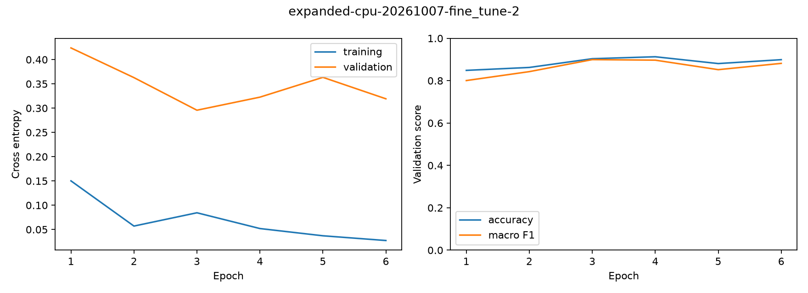
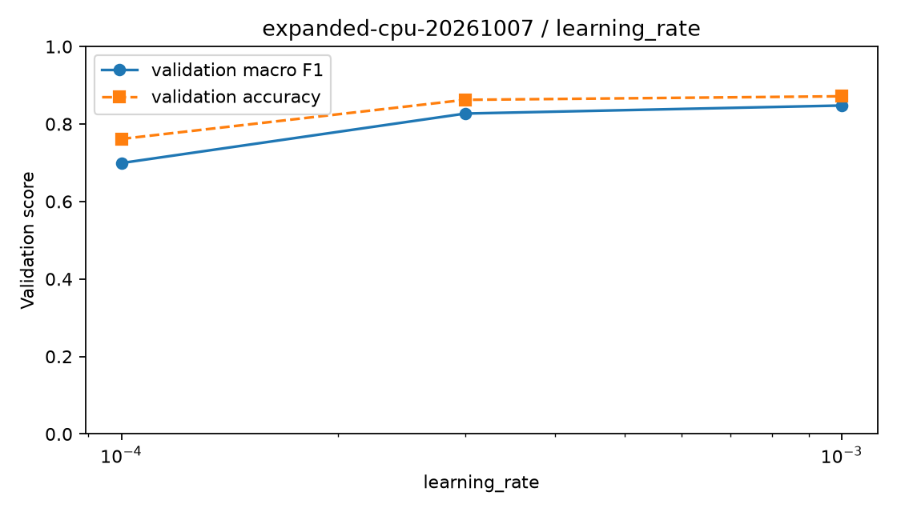
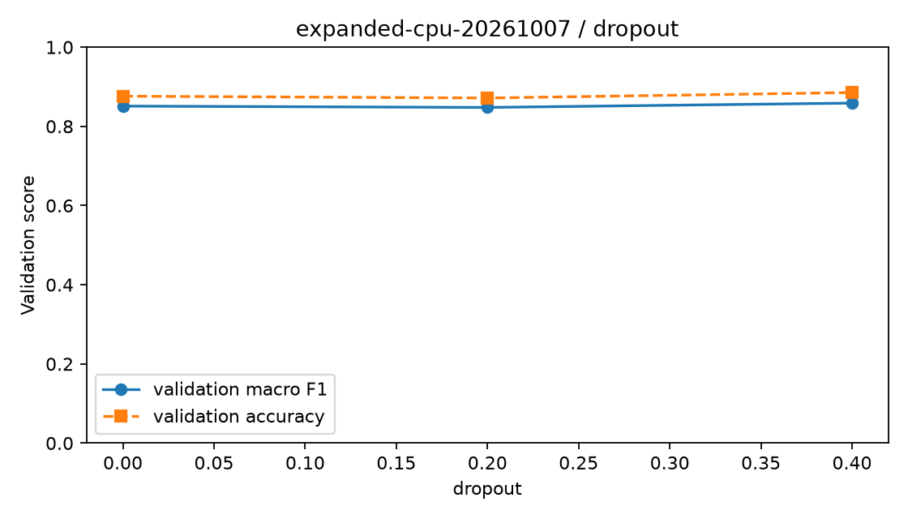
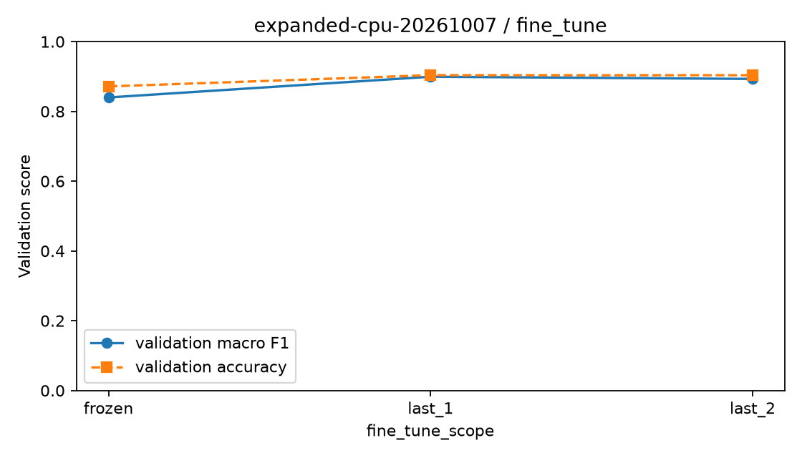
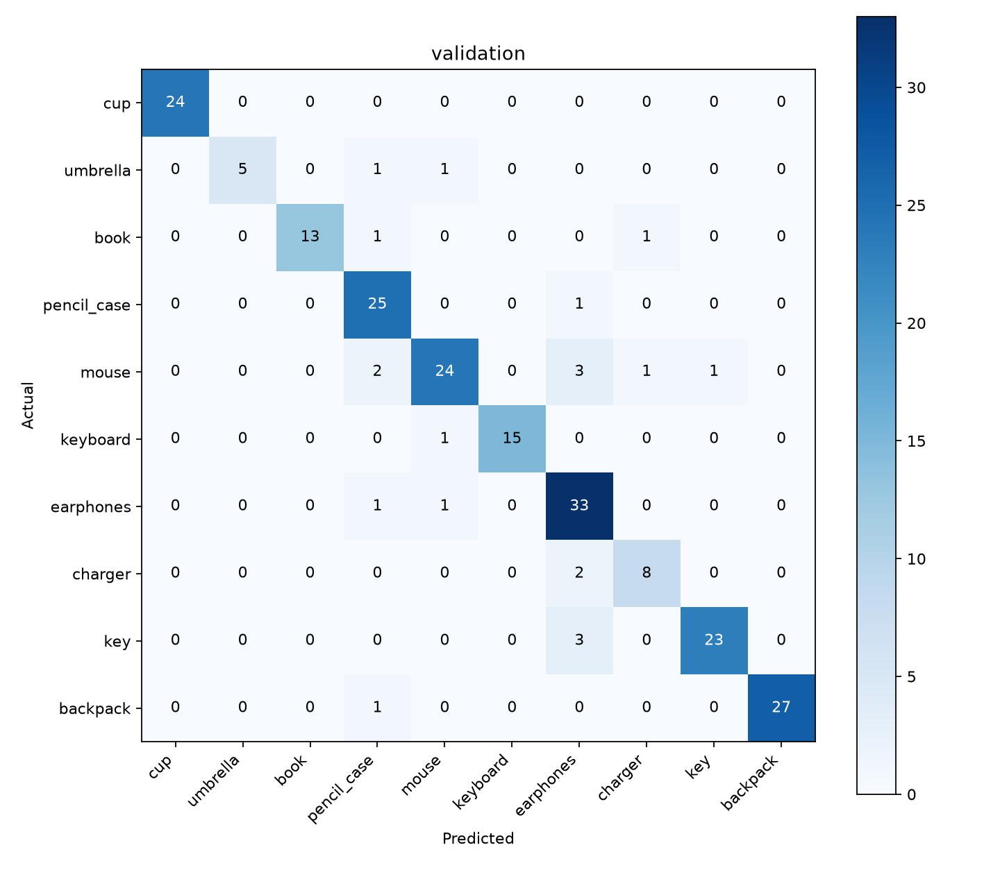

# 新版公开照片模型实验材料

生成时间：2026-10-07T21:14:03+08:00。只报告已保存的真实实验结果。

## 结论与验收边界

数据版本campus-public-expanded-v1，659张公开训练、218张公开验证；新版胜出验证准确率90.37%、宏F1=0.8993。
本机Windows CPU完成三阶段和完整流程复核，模型保持experimental。WSL GPU正式训练、独立实拍测试、Android和真实云端验收仍待完成。
公开验证成绩用于选参，不能作为独立实拍准确率验收成绩。旧版514张先导实验保留在ml-experiments.md，两版划分不同，成绩不作直接提升率比较。

## 数据与来源

公开候选2288张，审核通过877张、拒绝1411张。通过照片来自Commons 557张、Open Images 320张。独立手机实拍0张，公开照片不记为自采成果。
Commons及Open Images官方人工正标签候选均经图像审核；来源中的public-test属于公开训练/验证来源，独立实拍测试另行冻结。
按SHA、来源、感知哈希及人工拍摄系列分组。无法确认公开实物身份时object_id为空，分组不能证明完全实体隔离；585张早期候选的上游修订号未保留，下载版本以原始字节SHA-256标识，未虚构修订号。
数据元数据SHA-256：`d49b776fc1bf33e162353d35357d8bb5d54effbf3c2b9dddf2928fed12d4689a`。类别campus-10-v2，键盘仅独立外接计算机键盘。

| 类别 | 训练 | 验证 | 公开通过 | 补拍缺口 |
| --- | ---: | ---: | ---: | ---: |
| 水杯 | 73 | 24 | 97 | 0 |
| 雨伞 | 23 | 7 | 30 | 50 |
| 书本 | 44 | 15 | 59 | 21 |
| 笔袋 | 77 | 26 | 103 | 0 |
| 鼠标 | 93 | 31 | 124 | 0 |
| 键盘 | 48 | 16 | 64 | 16 |
| 耳机 | 106 | 35 | 141 | 0 |
| 充电器 | 31 | 10 | 41 | 39 |
| 钥匙 | 78 | 26 | 104 | 0 |
| 背包 | 86 | 28 | 114 | 0 |

已采集877张公开训练/验证照片；独立实拍目前0张，计划约200张，另行计数。后续126张训练/验证补拍另行计数并冻结新版本。采集规则见ml-photo-gaps.md。

## 候选实验

MobileNetV2/ImageNet alpha=1.0，GAP、Dropout、10类Softmax；raw RGB float32输入，模型内归一化。只有训练集增强；BN始终冻结。相同阶段初始化、冻结数据、环境及种子42。
本机顺序执行候选，四PC任务配置保存在campaign/pc-tasks。按宏F1、准确率、较低损失、较小微调范围及候选顺序选择。每轮原子保存模型/优化器和进度；23:00前停止长任务。

| 阶段 | 候选 | 轮数 | 验证准确率 | 宏F1 | 验证损失 | 训练秒数 |
| --- | --- | ---: | ---: | ---: | ---: | ---: |
| learning_rate | 0.0001 | 20 | 76.15% | 0.6992 | 0.8208 | 259.6 |
| learning_rate | 0.0003 | 20 | 86.24% | 0.8269 | 0.4859 | 230.6 |
| learning_rate | 0.001 | 20 | 87.16% | 0.8477 | 0.3935 | 229.6 |
| dropout | 0 | 17 | 87.61% | 0.8511 | 0.3871 | 192.6 |
| dropout | 0.2 | 20 | 87.16% | 0.8477 | 0.3935 | 255.6 |
| dropout | 0.4 | 20 | 88.53% | 0.8587 | 0.3681 | 282.7 |
| fine_tune | frozen | 11 | 87.16% | 0.8399 | 0.3550 | 172.9 |
| fine_tune | last_1 | 6 | 90.37% | 0.8993 | 0.2957 | 96.3 |
| fine_tune | last_2 | 6 | 90.37% | 0.8930 | 0.3065 | 102.9 |

胜出分类头学习率0.001，Dropout 0.4，微调last_1，微调学习率0.0001。最终使用种子42检查点。
种子43完整流程复核：准确率90.83%、宏F1=0.8842；宏F1差0.01509。
差异未超过0.05，无需追加种子44。

## 全10类验证指标

| 类别 | 精确率 | 召回率 | F1 | 数量 |
| --- | ---: | ---: | ---: | ---: |
| 水杯 | 1.0000 | 1.0000 | 1.0000 | 24 |
| 雨伞 | 1.0000 | 0.7143 | 0.8333 | 7 |
| 书本 | 1.0000 | 0.8667 | 0.9286 | 15 |
| 笔袋 | 0.8065 | 0.9615 | 0.8772 | 26 |
| 鼠标 | 0.8889 | 0.7742 | 0.8276 | 31 |
| 键盘 | 1.0000 | 0.9375 | 0.9677 | 16 |
| 耳机 | 0.7857 | 0.9429 | 0.8571 | 35 |
| 充电器 | 0.8000 | 0.8000 | 0.8000 | 10 |
| 钥匙 | 0.9583 | 0.8846 | 0.9200 | 26 |
| 背包 | 1.0000 | 0.9643 | 0.9818 | 28 |

各类数量不同，少样本类别指标不稳定；错误预测明细、10×10混淆矩阵及错误照片单独保存。未使用实拍测试调参。

验证集出现次数最多的混淆：钥匙→耳机 3张；鼠标→耳机 3张；充电器→耳机 2张；鼠标→笔袋 2张；背包→笔袋 1张。

## 阈值、FP32与一致性

阈值0.50，状态validation_selected，只用验证集选择；候选支持数和准确率见winner result.json的threshold表。始终输出Top-1，低置信仅人工确认提示。
FP32 TFLite实际8,939,040字节，SHA-256=`7bde6b570248b2795f6165a12d7bf763615ae2763c16ed17862da8cac5bc3558`。转换只允许内置算子、关闭量化。
完整218张验证集Keras/TFLite最大分数差3.3378601e-06，Top-1变化0。20张真实交接照片、输入张量及完整分数保存在发布包examples。
本机CPU单线程、20次预热/100次计时：纯推理P50/P95=19.49/31.18ms；预处理加推理=43.73/64.26ms。不是手机或真实云端性能。

## 证据与复现

源码摘要：`e82cc002ba469f1dd09df4cc1976542d9938ecf40581c823abf0f9d283f93e45`；每个run保留code-snapshot、installed-dependencies.lock、每轮历史、best.keras和可续训检查点。数据和类别都显式引用冻结版本。
各阶段表格与参数曲线：`experiments/reports/expanded-cpu-20261007/`；胜出训练曲线：`experiments/reports/expanded-cpu-20261007-fine_tune-2/training-curves.png`。
10×10混淆矩阵、每张预测和错误样例：`experiments/reports/evaluations/expanded-cpu-v1/`；Keras/LiteRT比较和发布文件哈希：`models/releases/expanded-cpu-v1/`。
复现命令：`python scripts/run-ml-campaign.py --config ml/configs/public-expanded-cpu.json --campaign <新ID> --version <新模型版本>`。匹配环境锁与冻结照片，不能把不同环境或源码的候选混在同一阶段。
完成管理员安装、重启及Ubuntu首次账号后，执行WSL脚本生成实测公共batch的GPU配置，另开GPU campaign，完成后用--formal冻结模型。
组长提供独立实拍清单；Android/云端按参考张量→图片完整链路核对，20次预热/至少100次计时；各项未完成就保持pending。交付及操作见ml-handover.md。

## 验证阈值扫描明细

| 阈值 | 高置信数量 | 覆盖率 | 高置信准确率 |
| ---: | ---: | ---: | ---: |
| 0.50 | 210 | 96.33% | 90.95% |
| 0.55 | 206 | 94.50% | 91.75% |
| 0.60 | 203 | 93.12% | 92.61% |
| 0.65 | 198 | 90.83% | 93.94% |
| 0.70 | 194 | 88.99% | 94.33% |
| 0.75 | 191 | 87.61% | 95.29% |
| 0.80 | 186 | 85.32% | 96.24% |
| 0.85 | 179 | 82.11% | 97.21% |
| 0.90 | 168 | 77.06% | 98.81% |
| 0.95 | 152 | 69.72% | 98.68% |

## 报告配图

