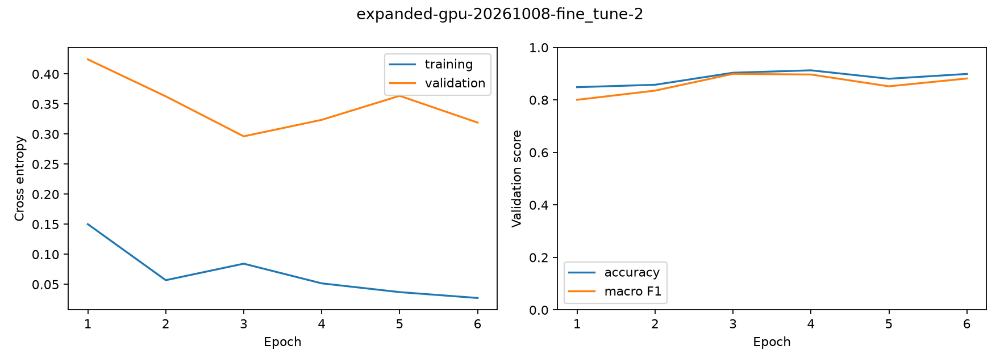
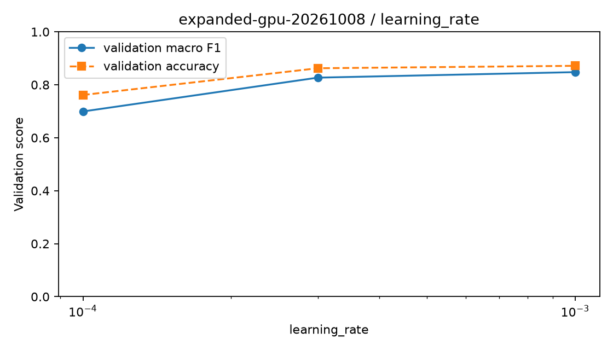
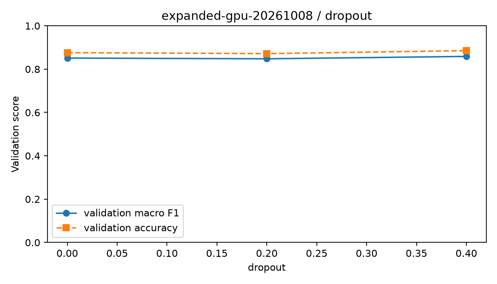
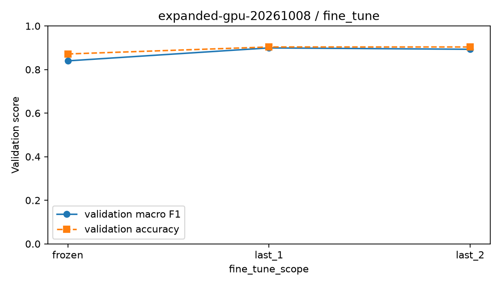
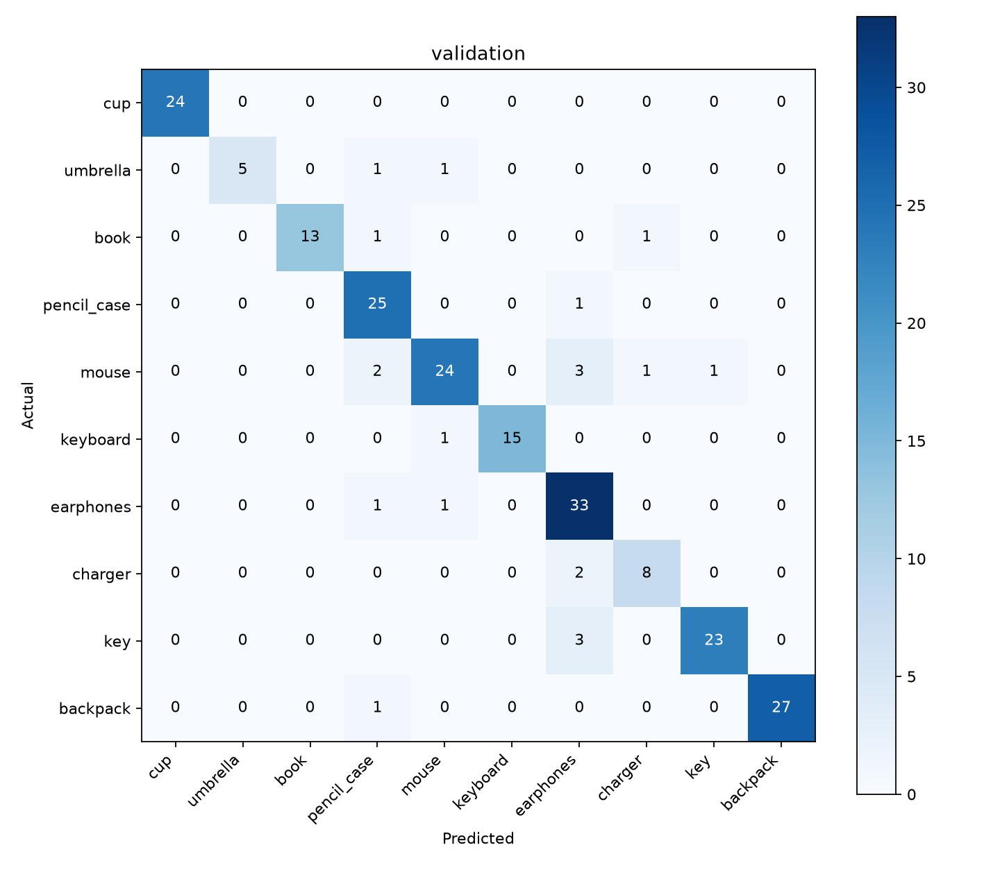

# GPU模型训练实验材料

生成时间：2026-10-08T22:24:46+08:00。数字来自冻结清单和保存的实验记录。

## 当前结果与验收状态

模型`campus-gpu-v1`已冻结。公开验证准确率90.37%、宏平均F1=0.8993。
frozen表示模型、阈值和输入合同冻结，可以开始独立评估；不代表独立实拍及端云验收已达标。独立实拍、真实Android和腾讯云结果仍待对应成员提供。

## 数据与类别

数据版本`campus-public-expanded-v1`：训练659张、验证218张，均为公开照片。独立手机实拍当前0张，计划约200张，另行冻结，未用于选参。
审核通过877张：Commons 557张，Open Images 320张；候选2288张，拒绝1411张。公开照片不记作自采成果。
SHA-256、来源、感知哈希与人工系列分组用于隔离。公开照片无法确认实物时object_id为空，来源和近重复隔离不能证明完全实体隔离；585张早期候选的上游修订号未保存，以实际下载字节哈希标识版本。
类别`campus-10-v2`；键盘仅独立外接计算机键盘。数据元数据SHA-256：`d49b776fc1bf33e162353d35357d8bb5d54effbf3c2b9dddf2928fed12d4689a`。

| 类别 | 训练 | 验证 | 已审核公开图 | 补拍缺口 |
| --- | ---: | ---: | ---: | ---: |
| 水杯 | 73 | 24 | 97 | 0 |
| 雨伞 | 23 | 7 | 30 | 50 |
| 书本 | 44 | 15 | 59 | 21 |
| 笔袋 | 77 | 26 | 103 | 0 |
| 鼠标 | 93 | 31 | 124 | 0 |
| 键盘 | 48 | 16 | 64 | 16 |
| 耳机 | 106 | 35 | 141 | 0 |
| 充电器 | 31 | 10 | 41 | 39 |
| 钥匙 | 78 | 26 | 104 | 0 |
| 背包 | 86 | 28 | 114 | 0 |

训练/验证补拍缺口共126张，优先雨伞、书本、外接键盘和充电器；补拍实物与独立测试实物分开。新图使用新数据版本，不能修改本次冻结划分。

## 训练设置与候选对照

RTX4060 Laptop、WSL2/Ubuntu24.04、Python3.12.3、TensorFlow2.21.0、Keras3.12.1、NumPy2.1.3；实际依赖锁随交付保存。完整float32计算，TensorFloat-32关闭，所有候选batch32、种子42、最多20轮、验证损失早停3轮。
ImageNet MobileNetV2 alpha=1.0、GAP、Dropout、10类Softmax，模型内部x/127.5-1；只有训练集增强。BN参数和统计量冻结，骨干training=False。阶段依次执行，按宏F1、准确率、低损失、较小微调范围及候选顺序选择。微调从相同胜出头开始，新Adam学习率为头学习率的1/10。
首个真实训练轮耗时6.64秒；训练计时不含读图、检查点写入和导出。每轮保存优化器与随机状态，北京时间23:00前停止并支持续作。四PC任务保存在campaign/pc-tasks，未宣称异机实测或并行加速。

| 阶段 | 候选 | 实际轮数 | 准确率 | 宏F1 | 验证损失 | 训练秒数 |
| --- | --- | ---: | ---: | ---: | ---: | ---: |
| learning_rate | 0.0001 | 20 | 76.15% | 0.6992 | 0.8208 | 47.4 |
| learning_rate | 0.0003 | 20 | 86.24% | 0.8269 | 0.4859 | 50.1 |
| learning_rate | 0.001 | 20 | 87.16% | 0.8477 | 0.3935 | 47.9 |
| dropout | 0 | 17 | 87.61% | 0.8511 | 0.3871 | 43.3 |
| dropout | 0.2 | 20 | 87.16% | 0.8477 | 0.3935 | 56.4 |
| dropout | 0.4 | 20 | 88.53% | 0.8587 | 0.3681 | 56.8 |
| fine_tune | frozen | 11 | 87.16% | 0.8399 | 0.3550 | 30.0 |
| fine_tune | last_1 | 6 | 90.37% | 0.8993 | 0.2963 | 19.4 |
| fine_tune | last_2 | 6 | 90.37% | 0.8930 | 0.3030 | 20.3 |

九个候选记录的训练时间合计371.5秒。胜出头学习率0.001，Dropout 0.4，微调last_1，微调学习率0.0001；发布使用种子42最佳宏F1检查点。
种子43完整流程复核：准确率90.83%、宏F1=0.8846，与主实验F1差0.01474。
F1差异未超过0.05，无需追加种子44。

## 全10类公开验证指标

| 类别 | 精确率 | 召回率 | F1 | 数量 |
| --- | ---: | ---: | ---: | ---: |
| 水杯 | 1.0000 | 1.0000 | 1.0000 | 24 |
| 雨伞 | 1.0000 | 0.7143 | 0.8333 | 7 |
| 书本 | 1.0000 | 0.8667 | 0.9286 | 15 |
| 笔袋 | 0.8065 | 0.9615 | 0.8772 | 26 |
| 鼠标 | 0.8889 | 0.7742 | 0.8276 | 31 |
| 键盘 | 1.0000 | 0.9375 | 0.9677 | 16 |
| 耳机 | 0.7857 | 0.9429 | 0.8571 | 35 |
| 充电器 | 0.8000 | 0.8000 | 0.8000 | 10 |
| 钥匙 | 0.9583 | 0.8846 | 0.9200 | 26 |
| 背包 | 1.0000 | 0.9643 | 0.9818 | 28 |

少样本类别指标不稳定。错误预测明细及照片单独保存，未使用独立实拍成绩调参。
主要混淆：钥匙→耳机 3张；鼠标→耳机 3张；充电器→耳机 2张；鼠标→笔袋 2张；背包→笔袋 1张。

## 阈值、导出与运行时

低置信阈值0.50，状态`validation_selected`，只用验证集选择。始终输出Top-1，低置信只提示人工确认。

| 阈值 | 高置信数量 | 覆盖率 | 高置信准确率 |
| ---: | ---: | ---: | ---: |
| 0.50 | 210 | 96.33% | 90.95% |
| 0.55 | 206 | 94.50% | 91.75% |
| 0.60 | 203 | 93.12% | 92.61% |
| 0.65 | 198 | 90.83% | 93.94% |
| 0.70 | 195 | 89.45% | 94.36% |
| 0.75 | 191 | 87.61% | 95.29% |
| 0.80 | 185 | 84.86% | 96.22% |
| 0.85 | 178 | 81.65% | 97.19% |
| 0.90 | 168 | 77.06% | 98.81% |
| 0.95 | 152 | 69.72% | 98.68% |

FP32 TFLite实际8,939,040字节，低于15MB，只允许内置算子，关闭量化。模型SHA-256：`a58ca2be234d0d7e7db6bdec3853b3e077df6a88321da4f6bd7a8a5d5be51d13`；标签SHA-256：`3148fcb53e5859041bf7f6af5acbfb952a9d3fbd52a4fd334525b7d3af6a1064`。
完整验证集Keras/LiteRT最大分数差4.7087669e-06，Top-1变化0；20张真实交接照片每类2张，附输入张量、分数、标签与来源。
独立LiteRT环境已完成2份系统复核，每份包括全部20张参考张量和20次图片链路，Top-1一致，最大分数差0，未安装或导入TensorFlow。对应运行ID：`standalone-campus-gpu-v1-20261008`, `standalone-windows-campus-gpu-v1-20261008`。
本机Linux CPU单线程、预热20次、测100次：纯推理P50/P95=6.36/6.88ms，预处理加推理=20.71/33.60ms。这不是手机或腾讯云性能。

## 证据与复现

训练代码提交`222ff37e777ea4cc076f644c23fd09c4ec3ab113`，源码摘要`1d77a1f2b326f9c84623ad1ec0efe89ad9292e6e79a6405ff4a95829585c600f`。每个run保留源码快照、安装依赖锁、逐轮历史、best.keras及优化器续训检查点。环境预跑及84项GPU检查见`ml-gpu-environment.md`。
独立LiteRT参考张量与图片链路证据保存于environment/standalone-*及consistency目录；不安装或导入TensorFlow。Android及真实云端必须另外回传同图、设备及性能记录。

```bash
source scripts/activate-ml-wsl.sh
python scripts/run-ml-campaign.py --config ml/configs/wsl-campus-public-expanded-v1.json \
  --campaign <新的ID> --version <新的模型版本> --formal
```

匹配冻结数据、类别、代码和依赖，不合并不同环境候选。原campaign可以原命令续作；新配置或源码须使用新ID。CPU历史包与指标保持原记录，不用GPU结果改写它们。
模型及阈值冻结后，组长提供独立测试清单执行评估；后续模型不能重用已评估测试照片。真实验收和交接命令见ml-handover.md。

## 报告配图










